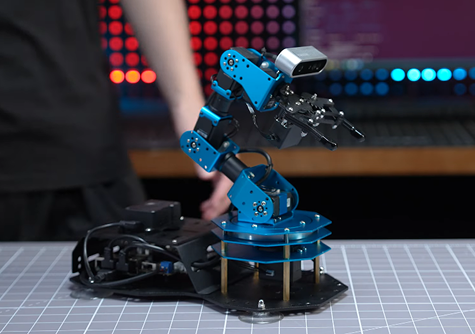

# ArmPi Ultra

English | [中文](https://github.com/Hiwonder/ArmPi-Ultra/blob/main/README_cn.md)

<p align="center">
  
</p>

## Product Overview

ArmPi Ultra is a desktop-level AI 3D vision robotic arm developed by Hiwonder for ROS education scenarios. It integrates a 3D depth camera with robotic arm control, combining 3D vision technology with precise manipulation. Equipped with 6 high-torque smart bus servos, Raspberry Pi 5 main controller, multifunctional expansion board, AI voice interaction box and other high-performance hardware, it utilizes built-in advanced kinematics algorithms to not only achieve 3D motion control but also accurately recognize, track, and grasp target objects in three-dimensional space.

ArmPi Ultra deploys multimodal AI large models that combine 3D vision, voice or text to deeply understand the environment, plan actions and flexibly execute tasks, enabling more advanced embodied intelligence applications. Through the Raspberry Pi CPU, it can perform machine learning model training, easily implementing various AI creative projects such as waste classification, object recognition, face recognition, and human feature recognition.

ArmPi Ultra adopts an exquisite modular design that supports multimodal expansion. Combined with Mecanum wheels, it can transform into a mobile handling robot to achieve mobile grasping and intelligent transportation functions. ArmPi Ultra also supports electric slide rail and electric conveyor belt expansion, allowing free construction of dual-arm collaboration, object sorting and other automation projects, applicable to diverse application scenarios!

## Official Resources

### Official Hiwonder
- **Official Website**: [https://www.hiwonder.com/](https://www.hiwonder.com/)
- **Product Page**: [https://www.hiwonder.com/products/armpi-ultra](https://www.hiwonder.com/products/armpi-ultra)
- **Official Documentation**: [https://docs.hiwonder.com/projects/ArmPi-Ultra/en/latest/](https://docs.hiwonder.com/projects/ArmPi-Ultra/en/latest/)
- **Technical Support**: support@hiwonder.com

## Key Features

### AI Vision & Recognition
- **3D Depth Vision** - Advanced 3D object detection and spatial perception
- **Object Recognition** - Machine learning-based object classification
- **Face Recognition** - Comprehensive facial detection and identification
- **Waste Classification** - AI-powered waste sorting and classification
- **Color Tracking** - Real-time color-based object tracking
- **Shape Recognition** - Geometric shape detection and analysis

### Advanced Manipulation
- **3D Space Grasping** - Precise object grasping in 3D space
- **Object Sorting** - Automated object classification and sorting
- **Object Tracking** - Real-time target tracking and manipulation
- **Tag Stackup** - AprilTag-based stacking operations
- **Finger Trace** - Hand gesture tracking and following
- **Calibration System** - Advanced camera and arm calibration tools

### Intelligent Control
- **Inverse Kinematics** - Advanced motion planning algorithms
- **ROS2 Integration** - Full Robot Operating System 2 support
- **Servo Control** - High-precision bus servo management
- **Multimodal Expansion** - Support for Mecanum wheels, slide rails, and conveyor belts
- **Voice Interaction** - AI-powered natural language commands
- **Simulation Support** - Complete development and testing environment

### Programming Interface
- **Python Programming** - Comprehensive Python SDK
- **ROS2 Packages** - Complete ROS2 package ecosystem
- **Multimodal AI Model** - Advanced embodied AI capabilities
- **YOLOv8 Detection** - State-of-the-art object detection framework
- **Open Source** - Complete open-source platform for customization

## Hardware Configuration
- **Processor**: Raspberry Pi 5
- **Operating System**: ROS2 compatible Linux
- **Vision System**: 3D depth camera with high-definition capabilities
- **Servos**: 6 high-torque smart bus servos
- **Expansion Board**: Multifunctional expansion board
- **AI Integration**: Multimodal AI large models with voice interaction box
- **Expansion Support**: Mecanum wheels, electric slide rails, electric conveyor belts

## Project Structure

```
armpi_ultra/
├── app/                    # Application modules
│   ├── calibration.py      # Camera and arm calibration
│   ├── color_tracker.py    # Color tracking application
│   ├── face_tracker.py     # Face tracking application
│   ├── finger_trace.py     # Finger tracing application
│   ├── grasp.py            # Grasping control
│   ├── object_sorting.py   # Object sorting application
│   ├── object_tracking.py  # Object tracking application
│   ├── shape_recognition.py # Shape recognition application
│   ├── tag_stackup.py      # Tag-based stacking application
│   └── waste_classification.py # Waste classification application
├── bringup/               # System startup and configuration
├── driver/                # Hardware drivers
│   ├── controller/        # Arm controller
│   ├── kinematics/        # Kinematics algorithms
│   ├── servo_controller/  # Servo control drivers
│   └── sdk/               # Hardware SDK
├── example/               # Example applications and demos
├── interfaces/            # ROS2 message definitions
├── large_models/          # AI large model integration
├── large_models_msgs/     # Large model message definitions
├── peripherals/           # Peripheral device support
├── simulations/           # Simulation environments
└── yolov8_detect/        # YOLOv8 object detection integration
```

## Version Information
- **Current Version**: ArmPi Ultra v1.0.0
- **Supported Platform**: Raspberry Pi 5

### Related Technologies
- [ROS2](https://ros.org/) - Robot Operating System 2
- [OpenCV](https://opencv.org/) - Computer Vision Library
- [YOLOv8](https://github.com/ultralytics/ultralytics) - Object Detection Framework
- [MoveIt](https://moveit.ros.org/) - Motion Planning Framework

---

**Note**: This program is pre-installed on the ArmPi Ultra robot system and can be run directly. For detailed tutorials, please refer to the [Official Documentation](https://docs.hiwonder.com/projects/ArmPi-Ultra/en/latest/).
